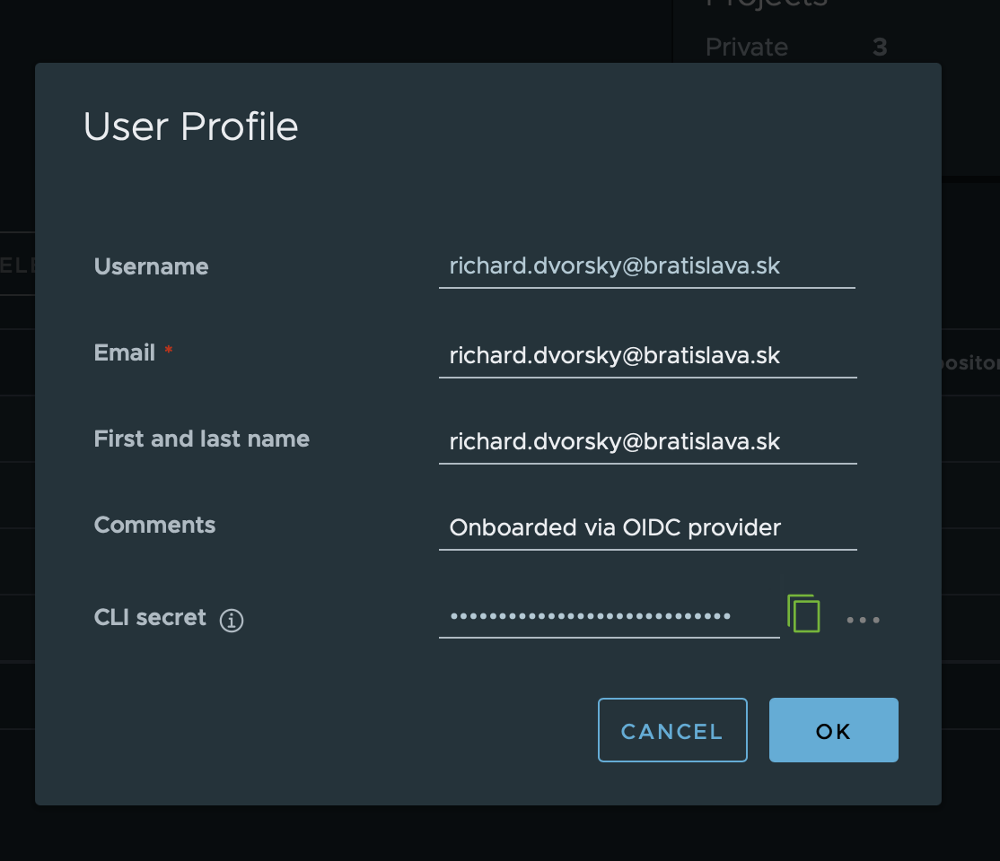

```bash
 ____                   _     _         _                             _   _ 
| __ )   _ __    __ _  | |_  (_)  ___  | | __   __ _            ___  | | (_)
|  _ \  | '__|  / _` | | __| | | / __| | |/ /  / _` |  _____   / __| | | | |
| |_) | | |    | (_| | | |_  | | \__ \ |   <  | (_| | |_____| | (__  | | | |
|____/  |_|     \__,_|  \__| |_| |___/ |_|\_\  \__,_|          \___| |_| |_|
```
### Simple deployment utility for our bratislava projects

## Prerequsities
To be able to work with this utility you need to have few things configured:

#### Installations:
1. Installed `git` (https://git-scm.com/book/en/v2/Getting-Started-Installing-Git)
2. Installed `kubectl` (https://kubernetes.io/docs/tasks/tools/)
3. Installed `docker` (https://docs.docker.com/engine/install)
4. Kustomization files in `/kubernetes` folder


#### Running apps:
These apps should be running when you start `bratiska-cli`:
1. Run `docker`
2. You need to be signed into our docker repository `harbor.bratislava.sk` See manual bellow.
3. You need have running `kubect` and be signed into the kubernetes cluster. If you have issues siging to kubernetes contact your administrator.


## Installation

Installing dependencies
```bash
npm install
```

Building cli in repo
```bash
npm run bratiska:build
```


## Usage
There is really simple usage, because utility tries to automatically obtain all values from the repo and if something is missing it will points out.
```bash
npm run bratiska
```

If you need to deploy to staging or production, you need to add special flag to command.
```bash
npm run bratiska -- --staging
```
or
```bash
npm run bratiska -- --production
```

### Run with more options

#### Namespace
Default namespace for utility is `standalone`, but you can change it to other like:
```bash
npm run bratiska -- --namespace=bratislava-monorepo
```

#### Deployment
Default deployment for app is name from `project.json`, but you can change it like:
```bash
npm run bratiska -- --deployment=nest-prisma-template-super-duper
```

#### Host
Default deployment host for an app deppends on `deployment` and `enviroment`, but you can change it like:
```bash
npm run bratiska -- --host=starwars.bratislava.sk
```

#### Enviroment
If you want to change enviroment, you can specify it there:
```bash
npm run bratiska -- --env=dev
```
Or you just switch env with `kubectl config use-context tkg-innov-dev`

#### Registry
If you want to use different registry like `ghcr.io` you can change it here, but don`t forget to add new credentials.
```bash
npm run bratiska -- --registry=ghcr.io
```

#### Staging and Production
To be able to deploy to stage you need to add `--staging` flag and your changes needs to be commited and pushed to branch to our repository. You cant have untracked chages.

Same applies for production, so you need to use `--production` and you changes needs to be merged to master, otherwise you can`t update production.

```bash
npm run bratiska -- --staging
```

#### Debug
If you need to debug the deploy process you can add `--debug` option. This will save kustomize manifest to the direcotry, so you can inspect it. Also it does not delete image from docker, so you can have a look on it.

```bash
npm run bratiska -- --debug
```

##### TODO
- add flag for choosing kusomisation folder.
- restrict deployment to prod to specific users

## More manuals

### Signing to harbor

We need to configure harbor connection for uploading images to registry.

1. Open our registry website: https://harbor.bratislava.sk
2. Sign in with your azure account
3. Copy CLI secret from your profile. Follow picture guide:

    - Go to your profile on right top corner:
      
    - Click on `User Profile`
    - Copy `CLI secret`
      
4. Sign in docker with command:
```bash
$ docker login https://harbor.bratislava.sk
```
using you username `your.name@bratislava.sk` and `CLI secret` value
5. When you see `Login Succeeded` then you are done 👏  


## Stay in touch
- If you find some bug, please contact us on github or mail inovacie@bratislava.sk
- Website - [https://inovacie.bratislava.sk/](https://inovacie.bratislava.sk/)
